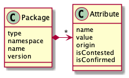
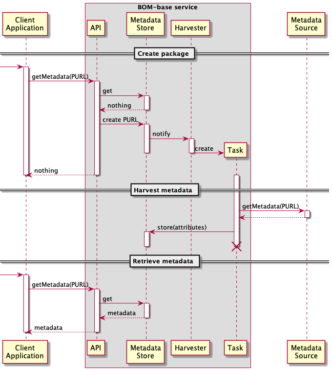

# BOM-base Service Architecture

## Introduction

### Purpose
This document provides a comprehensive architectural overview of the system,
using a number of different architectural views to depict different aspects of
the system. It is intended to convey the significant architectural decisions
which have been made on the system.

### Scope
BOM-base is an **experimental** caching repository for bill-of-materials metadata.

### Definition, Acronyms and Abbreviations
Term | Description
-----|------------
PURL | Package URL
SPDX | "The Software Package Data Exchange" - An open standard for communicating software bill of material information, including components, licenses, copyrights, and security references. SPDX reduces redundant work by providing a common format for companies and communities to share important data, thereby streamlining and improving compliance.

### References
- [SDPX License list](https://spdx.org/licenses/)
- [The Software Package Data Exchange (SPDX®) Specification Version 2.2](https://spdx.github.io/spdx-spec/)

## System context

A client (e.g. a bill-of-materials tool) requests metadata for a package from
the system. The system harvests the attributes of this metadata from external
sources (e.g. package management repositories and version control systems). A
curator manually resolves conflicting attribute values and add values that could
not be harvested automatically.

## Goals and constraints
Goals of the BOM-base service are:
1. Automatically collect metadata for relevant packages in a unified format.
2. Store metadata for non-public (inner source) packages.
3. Facilitate human curation of stored metadata.

The stakeholders of this application are:

- Metadata experts to maintain and curate metadata.
- Bill-of-materials tool developers.

The most significant requirements are:

- Package metadata shall be made available to clients in a single unified format.
- Licenses shall be stated as SPDX expressions.
- Package identification shall follow a public standard.
- Metadata shall be first harvested from local sources before external sources.  
- Metadata shall be harvested from all popular package management repositories.
- Metadata shall be harvested from the ClearlyDefined repository.
- Package licenses shall be harvested from downloaded source code.
- Metadata shall be cross-checked between sources where possible.
- Human curators shall resolve conflicting and incomplete metadata.

Design constraints are:

- Maintainability: Code must be easy to maintain for average programmers. This
  is why the code tries to adhere to "Clean Code" guidelines, and a strict
layering model is applied.

## Use-Case view

### Provide package metadata 

1. A client (typically some Bill-of-Materials generator) encounters a package it
   needs more information about, and requests the service for the metadata
   related to the package.
2. The service looks up the available metadata for the indicated package 
   and shares it with the client.

### Collect package metadata

1. A client encounters a package it needs more information about, and requests
   the service for the metadata related to the package.
2. The service did not know about the package before, and creates it in its data
   store.
3. The service notifies the client no information is available.
4. The service harvests package attributes from an external source (e.g. a
   package management repository), and stores it with the package.
5. The availability of a new attribute (e.g. the source code location) triggers
   the service to harvest more package attributes from another source (e.g. by
   scanning the package source code).
6. The service recursively harvests more attributes until there are no more
   sources to harvest from.

_Note that the harvesting attributes take time, and the client does not wait for
harvesting to complete. The resulting metadata is available the next time the
client requests the metadata for the same package._

### Correct failed harvesting 

1. The service fails to harvest from a source due to wrong attribute values, or
   temporary unavailability of the source.
2. A curator requests an overview of failed harvests.
2. Service lists failed packages with a cause of the failure.
3. The curator manually corrects attribute values.
4. Service recursively harvests more attributes using the updated attribute(s).

### Curate metadata

1. Service detects conflicting attribute values by harvesting values from
   alternative sources, and marks one or more attributes as "contested".
2. A curator requests an overview of packages with contested attributes.
2. Service lists packages with contested attributes to the human curator.
3. Curator reviews the package attributes and marks, and (after appropriate
   research) manually overrides attributes.
4. Service stores the updated attributes and marks them as "confirmed".

_Attributes that have been confirmed by the curator can not longer be contested.
In such cases the client must assume the curated attributes are correct._

### Use-case realization
The figure below provides the domain model for the system:

Packages are uniquely identified by:

1. Type: References a type of package management repository.
2. Namespace: (Optional) grouping for related packages or packages from the same
   origin, as used by the package manager for the type.
3. Name: Identifier for the package.
4. Version: Revision name for the package, using the version numbering mechanism
   of the package manager for the type.

## Logical view

When a client requests metadata for a package,

## Implementation view
(TO DO)

(End of document)
